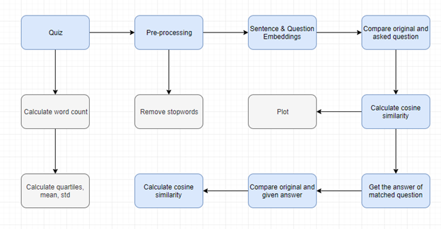

# Automated-Q-A-Checker-and-Feedback-Generator
## Proposed Approach

## Dataset Overview
Data is in a csv format. It will consist of two columns; questions and answers provided by lecturer. There is no limit of questions & answers asked in a quiz, it is totally up to the lecturer. 

## Embedding Models
We used three different embeddings to find the similarity score between the answer given and original answer, Bag of words, Word2Vec and Glove.
1.	Count Vectorizer: Convert a collection of text documents to a matrix of token count.
2.	Word2Vec: It is an algorithm which uses a neural network model to learn words associations from a large structure of text based on semantic similarity.
3.	Glove: Global vectors for words representation is an unsupervised learning algorithm and it also maps the words based on cosine similarity or distance between words that are related to semantic similarities. 
Word2vec, Bag of word and glove enable us to represent a word in the form of a vector often called embedding. They are the most popular algorithms for word embeddings that bring out the semantic and lexical similarity of words that captures different facets of the meaning of a word. They are used in many NLP applications such as sentiment analysis, document clustering, question answering, paraphrase detection and so on. 
Count Vectorizer
Count Vectorization involves counting the number of occurrences each word appears in a document (i.e., distinct text such as an article, book, even a paragraph!) and converts it to a numeric vector.

### Word2Vec
How is the word2vec model trained:
Word2Vec is a feed forward neural network-based model to find word embeddings. There are two models that are commonly used to train these embeddings: The skip-gram and the CBOW model. 
The Skip-gram model takes the input as each word in the corpus, sends them to a hidden layer (embedding layer) and from there it predicts the context words. Once trained, the embedding for a particular word is obtained by feeding the word as input and taking the hidden layer value as the final embedding vector. 
The CBOW (Continuous Bag of Words) model takes the input the context words for the given word, sends them to a hidden layer (embedding layer) and from there it predicts the original word. Once again, after training, the embedding for a particular word is obtained by feeding the word as input and taking the hidden layer value as the final embedding vector. 

### Glove
How is the Glove model trained?
Glove is based on matrix factorization techniques on the word-context matrix. It first constructs a large matrix of (words x context) co-occurrence information, i.e., for each “word” (the rows), you count how frequently we see this word in some “context” (the columns) in a large corpus.  The number of “contexts” is of course large, since it is essentially combinatorial in size.
So, then we factorize this matrix to yield a lower-dimensional (word x features) matrix, where each row now yields a vector representation for the corresponding word. In general, this is done by minimizing a “reconstruction loss”. This loss tries to find the lower-dimensional representations which can explain most of the variance in the high-dimensional data.

#### What is the difference between W2V and Glove?
Word2vec embeddings are based on training a shallow feedforward neural network while glove embeddings are learnt based on matrix factorization techniques.

#### Differences in the properties of word2vec and glove:
The two models differ in the way they are trained, and hence lead to word vectors with subtly different properties. Glove model is based on leveraging global word to word co-occurrence counts leveraging the entire corpus. Word2vec on the other hand leverages co-occurrence within local context (neighboring words).

## Accuracy

The above figure shows the accuracy/arithmetic mean for each embedding model. As, there were nine questions asked in the quiz. So, the above graph shows the mean of the similarity score for each answer. Which performed the best is defined in the section below.

## Explanation
Let’s take an example, by picking up a single question from the quiz and see how each embedding model worked in predicting the question and its answer.
Question: In Biology, what is the Nucleus and what does it do?
Original Answer: A nucleus is a membrane-bound that contains the cell’s chromosomes. Pores in the nuclear membrane allow for the passage of molecules in and out of the molecules.
Now, Glove and Bow made many wrong assumptions while predicting the question. According to Glove model the asked question was “What does the saying don’t cry wolf imply?” meanwhile Bag of words predicted that the asked question was “In football, what nickname does Jose Mourinho refer to himself as, and why?”. Therefore, the answered question by the student fetched from the file was also wrong. Glove model predicted correct questions by 22% (2/9 questions), Bag of word predicted by 44% (4/9 questions). Therefore, both these models are not suitable for our desired product. (Note: the main focus was to compare the asked question with the question in original quiz file, if matched correctly, then calculate the similarity score between the answers. Therefore, we can only move forward if the questions are correctly matched). Whereas Word2Vec predicted all the questions perfectly, 100%. So, we used the Word2Vec for calculating the similarity score between each question. The Arithmetic Mean or percentage of similarity score for Word2Vec was 90.6%. The aim was to find the similarity score and put some limit for correct and wrong answers. So, 100-65 was labelled as correct, 35-65 was labelled as needs improvement and less than 35 was labelled as wrong answer. So, this is how we created an automated checker and generates a feedback according to the marks acquired. 

## Application 
1. Login/Register
2. Upload the files. Test file and Zip file of student's answer. Files are stored in DB.
3. Request sent to backend
4. Similarity core calculated in real time.
5. Response sent back to front-end and display the results.
